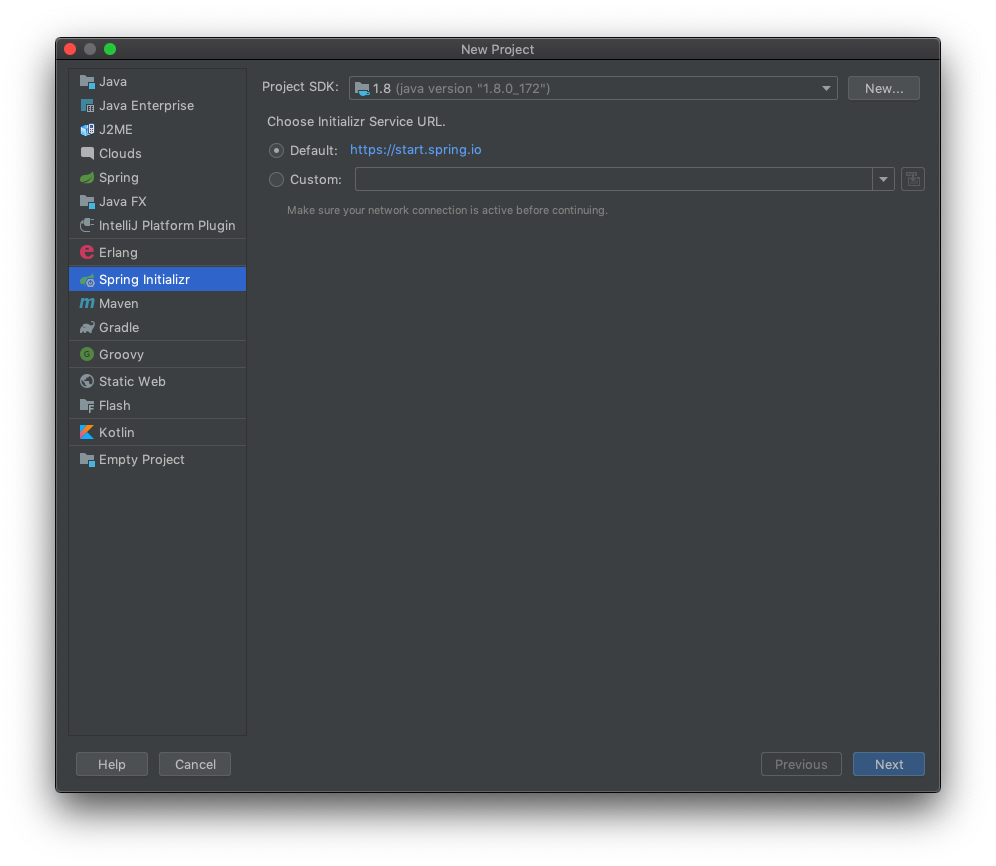
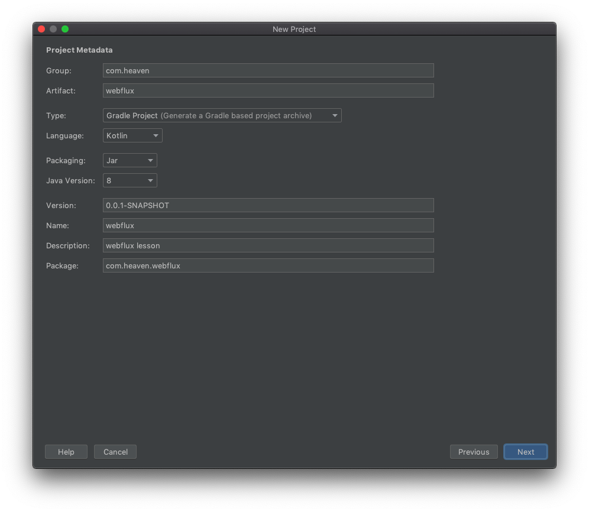
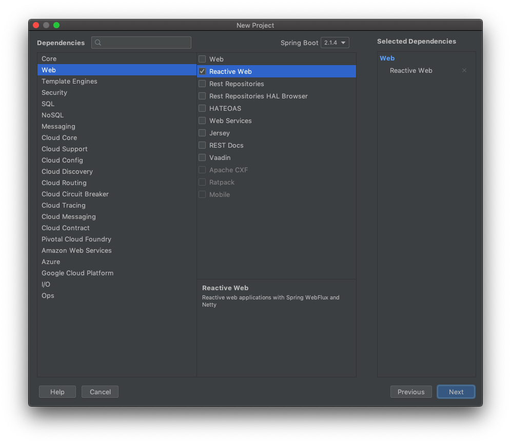
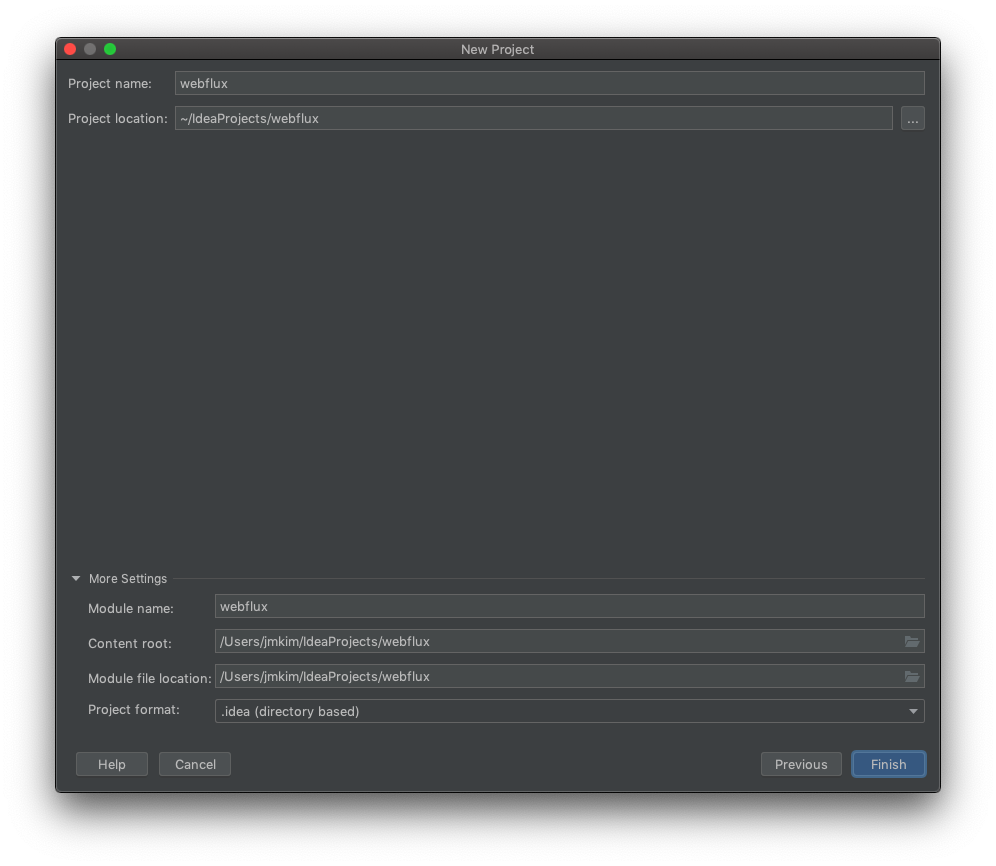
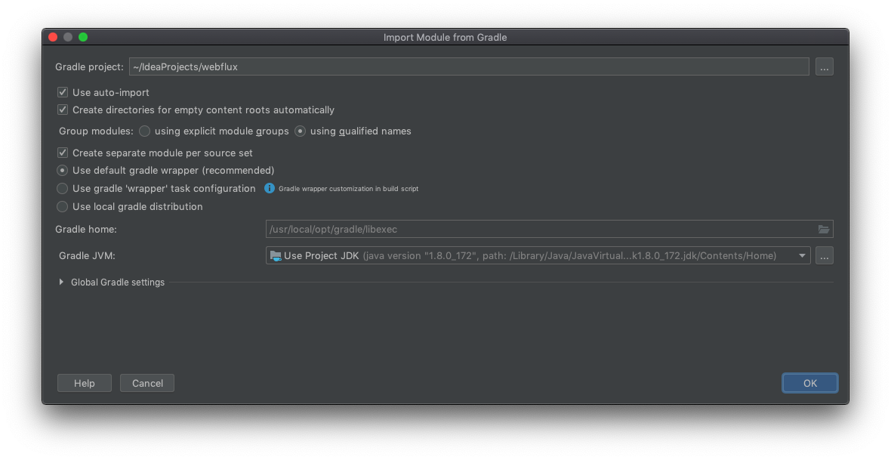
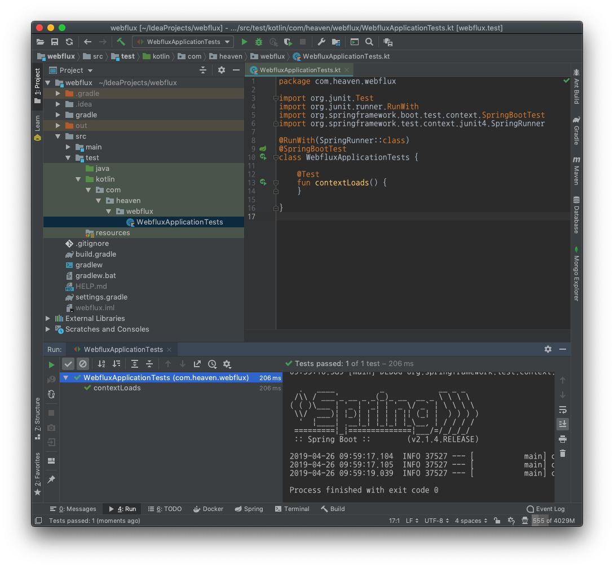
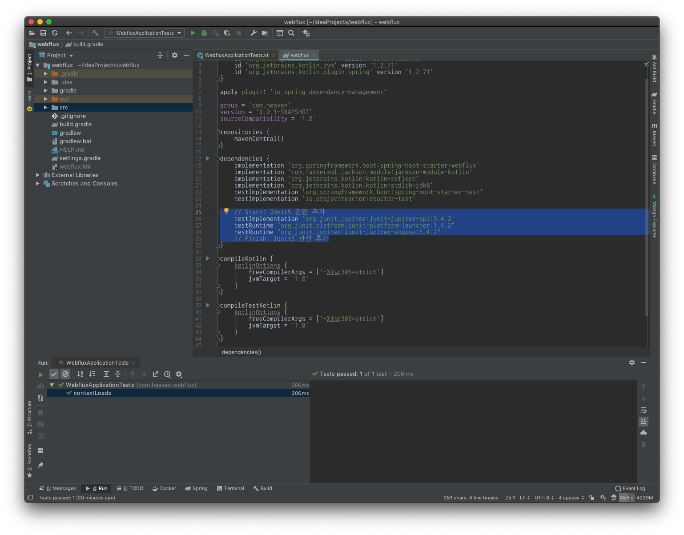
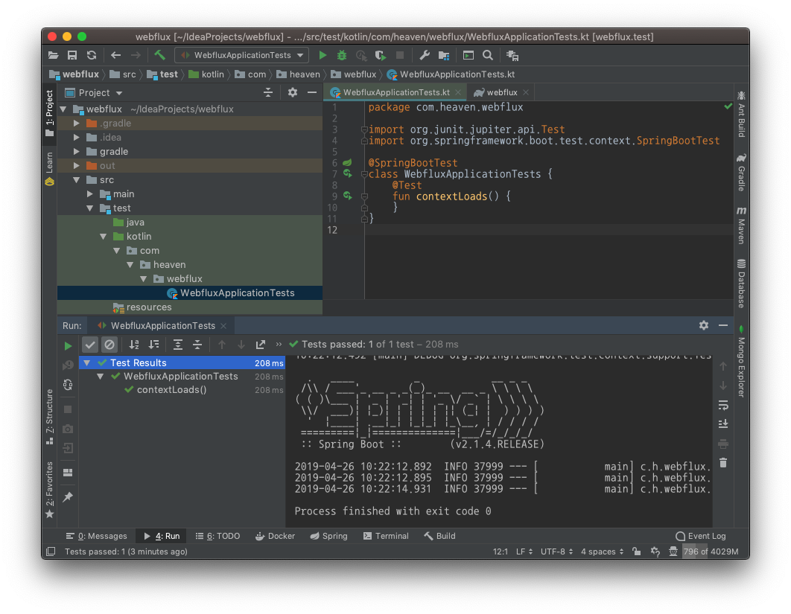
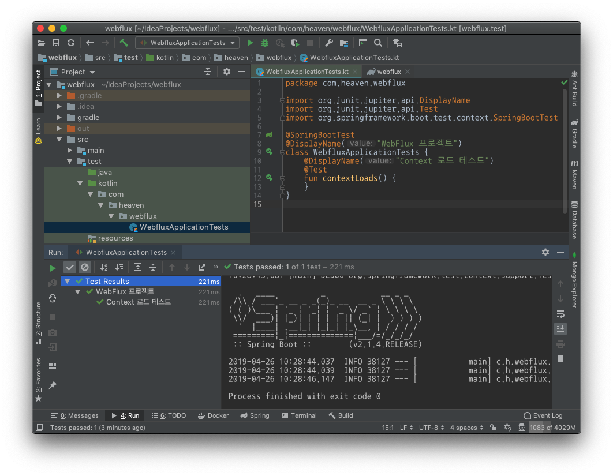

:toc:
:numbered:

= WebFlux 001 - 프로젝트 생성 및 설정

== 선수 학습

* Kotlin

* Project Reactor
** link:https://projectreactor.io/[https://projectreactor.io/]
** Mono
** Flux

* 참고
** Reactive Stream
*** link:https://www.reactive-streams.org/[https://www.reactive-streams.org/]

== intellij 를 이용한 프로젝트 생성

* 메뉴바 File -> New -> Project... 선택
* Spring Initializr 선택, [Next] 클릭

* ProjectMetadata 변경, [Next] 클릭
** Group: com.heaven
** Artifact: webflux
** Type: Gradle Project
** Language: Kotlin

* Dependecies 에서 Web / Reactive Web 선택, [Next] 클릭

* Project loacation 변경, [Next] 클릭

* User auto-import / Create directories ... 체크, [Next] 클릭

== Project 가 정상적으로 준비되었는지 확인

* src/test/kotlin/com/heaven/webflux/WebFluxApplicationTest 선택, 우클릭
* Run 'WebFluxApplicationTest' 선택
**  WebFluxApplicationTest 와 그 하위 항목인 contextLoads 의 초록색 v 체크 확인

== JUnit5 적용

* 프로젝트 root 의 build.gradle 를 열고 dependencies 블록 안에 아래 내용을 추가

[source, groovy]
----
// Start: JUnit5 관련 추가
testImplementation 'org.junit.jupiter:junit-jupiter-api:5.4.2'
testRuntime "org.junit.platform:junit-platform-launcher:1.4.2"
testRuntime "org.junit.jupiter:junit-jupiter-engine:5.4.2"
// Finish: JUnit5 관련 추가
----

=== WebFluxApplicationTest 에 JUnit5 적용

* @Test 애너테이션의 import 변경
** 기존: import org.junit.Test 
** 신규: import org.junit.jupiter.api.Test
* 필요없는 import 삭제
** import org.junit.runner.RunWith
** import org.springframework.test.context.junit4.SpringRunner

기존 소스
[source, kotlin, linenums]
----
package com.heaven.webflux

import org.junit.Test
import org.junit.runner.RunWith
import org.springframework.boot.test.context.SpringBootTest
import org.springframework.test.context.junit4.SpringRunner

@RunWith(SpringRunner::class)
@SpringBootTest
class WebfluxApplicationTests {
    @Test
    fun contextLoads() {
    }
}
----

변경 소스
[source, kotlin, linenums]
----
package com.heaven.webflux

import org.junit.jupiter.api.Test
import org.springframework.boot.test.context.SpringBootTest

@SpringBootTest
class WebfluxApplicationTests {
    @Test
    fun contextLoads() {
    }
}
----

* WebFluxApplicationTest 를 다시 실행해서 정상 동작 여부 확인

=== JUnit5 의 @DisplayName 을 적용해 테스트명을 더 직관적으로 변경

* 패키지 import 
** import org.junit.jupiter.api.DisplayName
* 클래스와 test 메소드에 @DisplayName 애너테이션 적용

[source, kotlin, linenums]
----
package com.heaven.webflux

import org.junit.jupiter.api.DisplayName
import org.junit.jupiter.api.Test
import org.springframework.boot.test.context.SpringBootTest

@SpringBootTest
@DisplayName("WebFlux 프로젝트")
class WebfluxApplicationTests {
    @DisplayName("Context 로드 테스트")
    @Test
    fun contextLoads() {
    }
}
----

