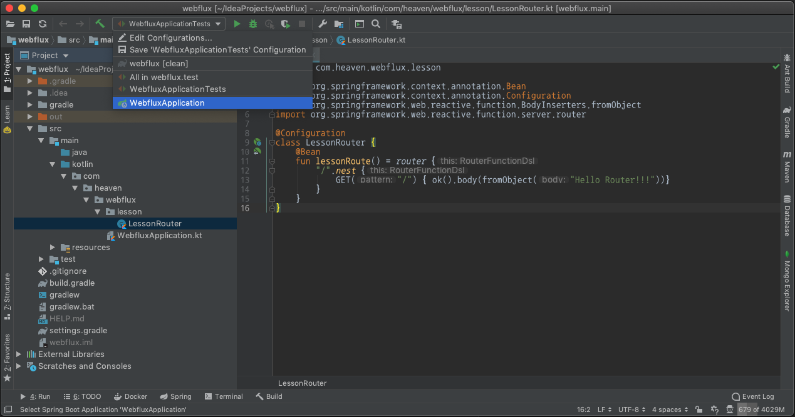
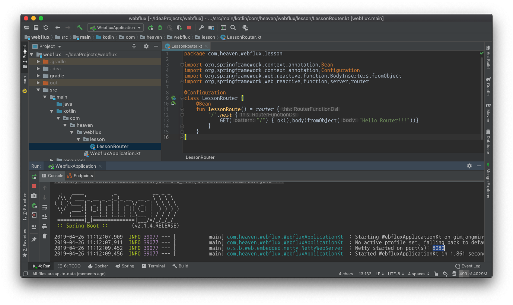
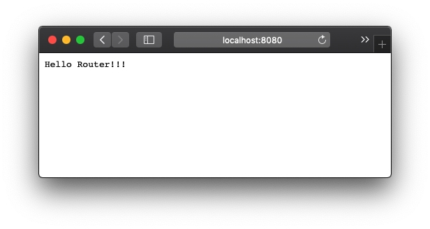
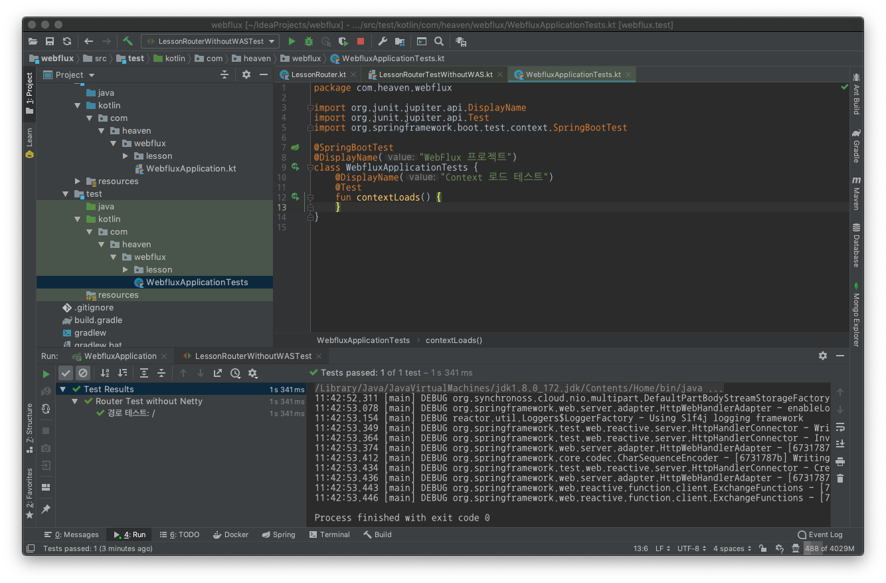
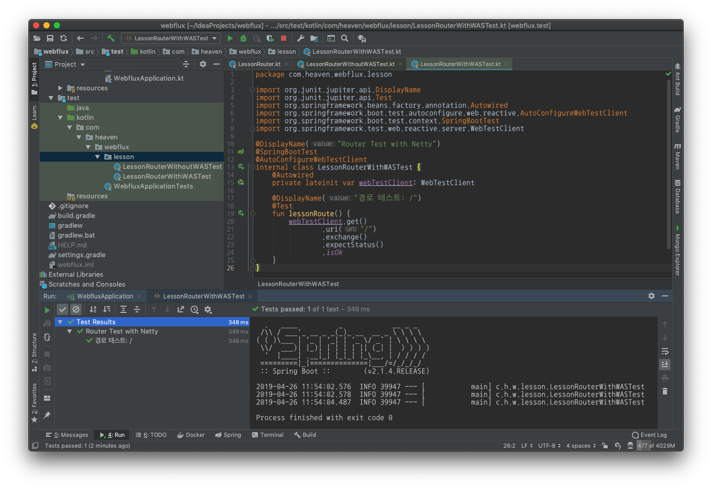

:toc:
:numbered:

= WebFlux 002 - RouterFunction & WebTestClient

== Router 생성

* src/main/kotlin/com/heaven/webflux 하위에 lesson 패키지 폴더 추가
* LessonRouter.kt 파일 추가
* 아래 내용 입력

.LessonRuter.kt
[source, Kotlin, linenums]
----
package com.heaven.webflux.lesson

import org.springframework.context.annotation.Bean
import org.springframework.context.annotation.Configuration
import org.springframework.web.reactive.function.BodyInserters.fromObject
import org.springframework.web.reactive.function.server.router

@Configuration
class LessonRouter {
    @Bean
    fun lessonRoute() = router {
        "/".nest {
            GET("/") { ok().body(fromObject("Hello Router!!!"))}
        }
    }
}
----

* 툴바에서 WebFluxApplication 선택 후 우측 플레이버튼 클릭

* 하단 Console 창에 SpringBoot 가 실행 결과 확인

Console 창에서 "Netty started on port(s): 8080" 를 확인할 수 있다. 브라우저를 통해 접근해 보자. 접근할 주소는 "http://localhost:8080/" 이다.

== WebTestClient 를 이용한 테스트 작성

=== WAS 없이 테스트

* src/test/kotlin/com/heaven/webflux 하위에 lesson 패키지 폴더 추가
* LessonRouterWithoutWASTest 코트린 파일 추가

.LessonRouterWithoutWASTest.kt
[source, kotlin, linenums]
----
package com.heaven.webflux.lesson

import org.junit.jupiter.api.DisplayName
import org.junit.jupiter.api.Test
import org.springframework.test.web.reactive.server.WebTestClient

@DisplayName("Router Test without Netty")
internal class LessonRouterWithoutWASTest {
    @DisplayName("경로 테스트: /")
    @Test
    fun lessonRoute() {
        val routeFunction= LessonRouter()
                .lessonRoute()

        val webTestClient = WebTestClient
                .bindToRouterFunction(routeFunction)
                .build()

        webTestClient.get()
                .uri("/")
                .exchange()
                .expectStatus()
                .isOk
    }
}
----

* 프로젝트 창에서 LessonRouterWithoutWASTest 우클릭
** Run 'LessonRouterWithoutWASTest' 클릭

=== WAS 와 연동 테스트

* LessonRouterWithWASTest 코트린 파일 추가

.LessonRouterWithoutWASTest.kt
[source, kotlin, linenums]
----
package com.heaven.webflux.lesson

import org.junit.jupiter.api.DisplayName
import org.junit.jupiter.api.Test
import org.springframework.beans.factory.annotation.Autowired
import org.springframework.boot.test.autoconfigure.web.reactive.AutoConfigureWebTestClient
import org.springframework.boot.test.context.SpringBootTest
import org.springframework.test.web.reactive.server.WebTestClient

@DisplayName("Router Test with Netty")
@SpringBootTest
@AutoConfigureWebTestClient
internal class LessonRouterWithWASTest {
    @Autowired
    private lateinit var webTestClient: WebTestClient
    
    @DisplayName("경로 테스트: /")
    @Test
    fun lessonRoute() {
        webTestClient.get()
                .uri("/")
                .exchange()
                .expectStatus()
                .isOk
    }
}
----

=== RouteFunction 의 역할

* 외부 접근 URL 설정