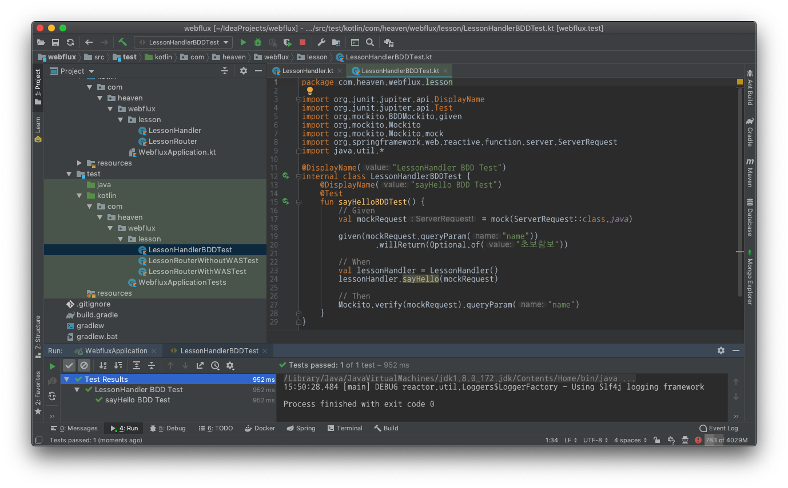

:toc:
:numbered:

= WebFlux 003 - HandlerFunction & BDD

== HandlerFunction 생성

* src/main/kotlin/com/heaven/webflux/lesson 폴더로 이동
* LessonHandler.kt 파일 추가
* 아래 내용 입력

.LessonHandler.kt
[source, kotlin, linenums]
----
package com.heaven.webflux.lesson

import org.springframework.stereotype.Component
import org.springframework.web.reactive.function.BodyInserters.fromObject
import org.springframework.web.reactive.function.server.ServerRequest
import org.springframework.web.reactive.function.server.ServerResponse
import org.springframework.web.reactive.function.server.ServerResponse.ok
import reactor.core.publisher.Mono

@Component
class LessonHandler {
    fun sayHello(serverRequest: ServerRequest): Mono<ServerResponse> {
        val name = serverRequest.queryParam("name")
        
        return ok().body(fromObject("Hello $name!!!"))
    }
}
----

== HandlerFunction Test 작성

여기서 고민할 부분은 테스트를 (소의의) TDD 인 결과값을 검증할 것인지 아니면 BDD 로 행위를 검증할 것인지이다. 결과값으로 HandlerFunction 은 Mono<ServerResponse> 를 돌려주는데 ServerResponse 에 대한 TDD 는 생각보다 해야할 일이 많다. 따라서 여기서는 BDD 를 이용한 테스트 검증을 실시하는 것이 정신 건강에 좋다.

* src/test/kotlin/com/heaven/webflux/lesson 폴더로 이동
* LessonHandlerBDDTest.kt 파일 추가

.LessonHandlerBDDTest.kt
[source, kotlin, linenums]
----
package com.heaven.webflux.lesson

import org.junit.jupiter.api.DisplayName
import org.junit.jupiter.api.Test
import org.mockito.BDDMockito.given
import org.mockito.Mockito
import org.mockito.Mockito.mock
import org.springframework.web.reactive.function.server.ServerRequest
import java.util.*

@DisplayName("LessonHandler BDD Test")
internal class LessonHandlerBDDTest {
    @DisplayName("sayHello BDD Test")
    @Test
    fun sayHelloBDDTest() {
        // Given
        val mockRequest = mock(ServerRequest::class.java)

        given(mockRequest.queryParam("name"))
                .willReturn(Optional.of("초보람보"))

        // When
        val lessonHandler = LessonHandler()
        lessonHandler.sayHello(mockRequest)

        // Then
        Mockito.verify(mockRequest).queryParam("name")
    }
}
----

=== HandlerFunction 의 역할

* 사용자의 요청(Request)를 받아 처리한 후 응답(Response)