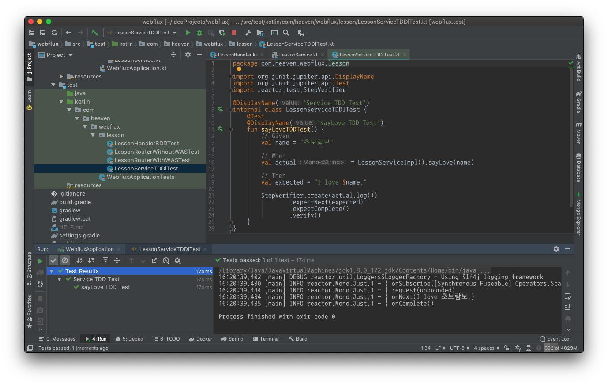

:toc:
:numbered:

= WebFlux 004 - Service & Test

== Service 생성

* src/main/kotlin/com/heaven/webflux/lesson 폴더로 이동
* LessonService.kt 파일 추가
* 아래 내용 입력

.LessonService.kt
[source, kotlin, linenums]
----
package com.heaven.webflux.lesson

import org.springframework.stereotype.Service
import reactor.core.publisher.Mono

interface LessonService {
    fun sayLove(name: String): Mono<String>
}

@Service
class LessonServiceImpl: LessonService {
    override fun sayLove(name: String): Mono<String> = 
            Mono.just("I love $name.")
}
----

== Service Test 작성

현재 구현한 소스는 단순하게 값을 생성해서 리턴하고 있기 때문에 행위를 검증하는 BDD 보다는 TDD 가 더 적당하다.

* src/test/kotlin/com/heaven/webflux/lesson 폴더로 이동
* LessonServiceTDDlTest.kt 파일 추가

.LessonServiceTDDlTest.kt
[source, kotlin, linenums]
----
package com.heaven.webflux.lesson

import org.junit.jupiter.api.DisplayName
import org.junit.jupiter.api.Test
import reactor.test.StepVerifier

@DisplayName("Service TDD Test")
internal class LessonServiceTDDlTest {
    @Test
    @DisplayName("sayLove TDD Test")
    fun sayLoveTDDTest() {
        // Given
        val name = "초보람보"

        // When
        val actual = LessonServiceImpl().sayLove(name)

        // Then
        val expected = "I love $name."

        StepVerifier.create(actual.log())
                .expectNext(expected)
                .expectComplete()
                .verify()
    }
}
----

21번째 줄에서 StepVerifier.create(actual.log()) 에서 호출한 log 함수는 Reactor 의 로그를 테스트 결과화면에 보여준다. log() 를 빼고 실행해도 테스트 결과에는 아무런 영향이 없다.

