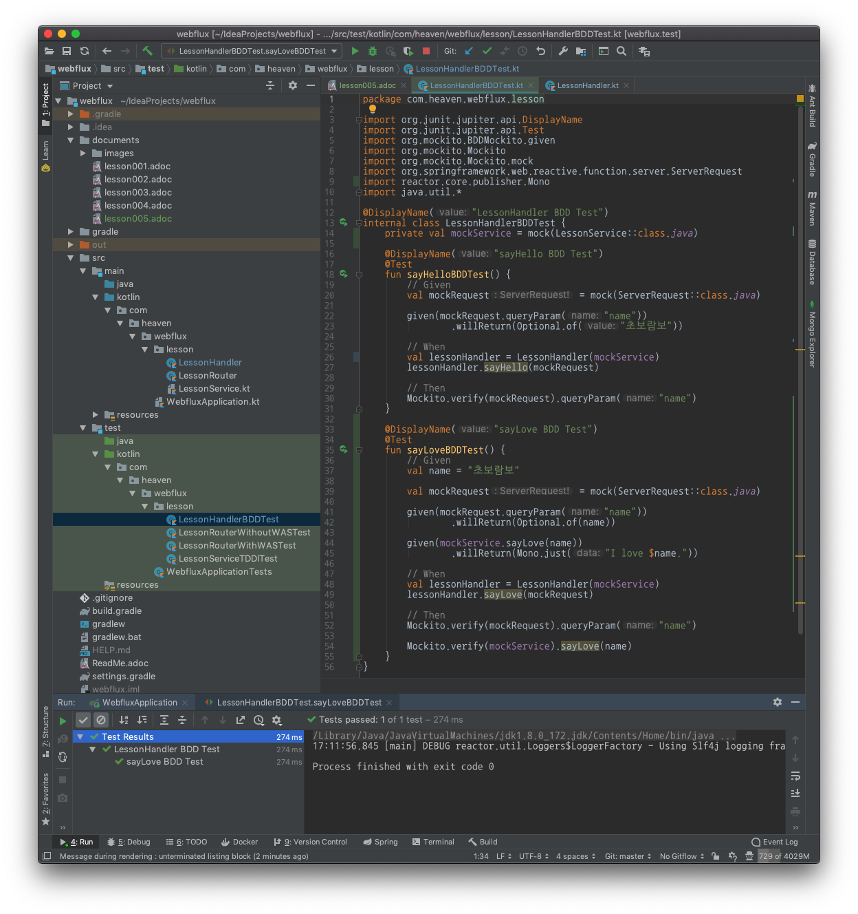
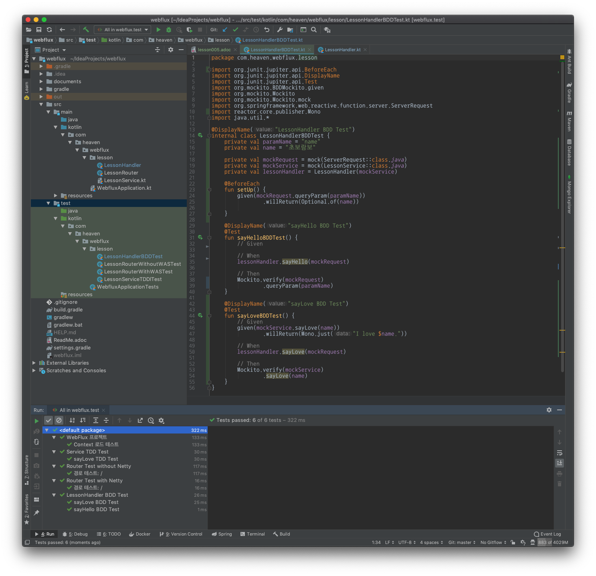
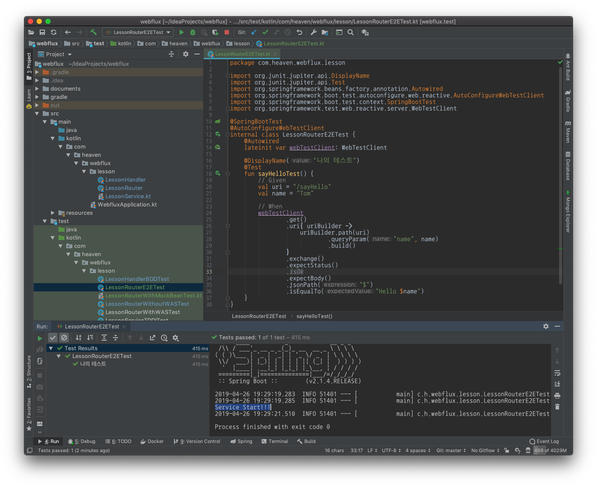
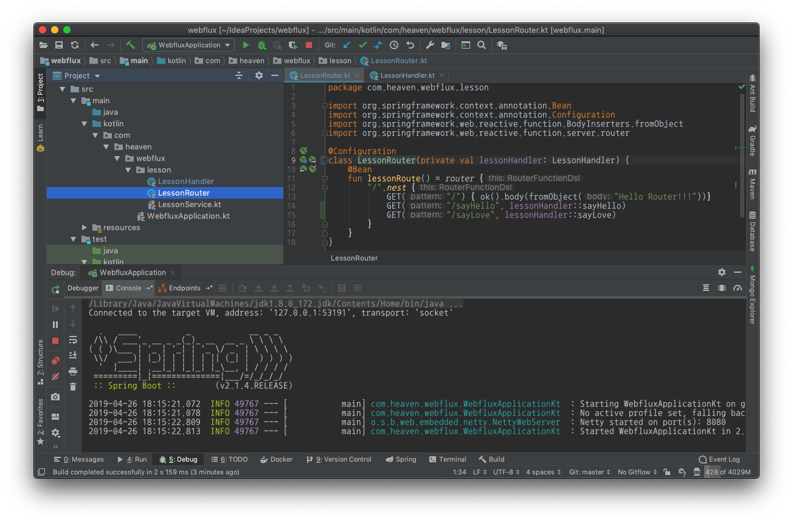
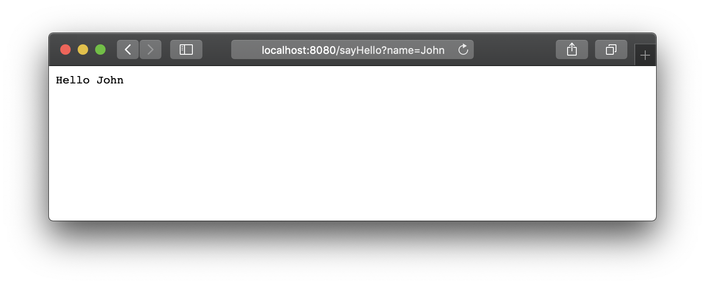
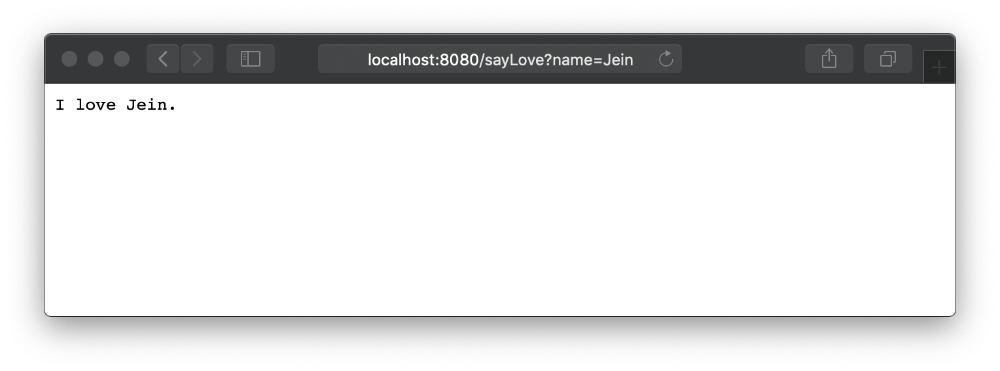

:toc:
:numbered:

= WebFlux 005 - Router, Handler, Service 연동하기

== Handler 에 Service 에 맞취 추가 메서드 생성

* LessonHandler.kt 를 아래 같이 수정

.LessonHandler.kt
[source, kotlin, linenum]
----
package com.heaven.webflux.lesson

import org.springframework.stereotype.Component
import org.springframework.web.reactive.function.BodyInserters.fromObject
import org.springframework.web.reactive.function.server.ServerRequest
import org.springframework.web.reactive.function.server.ServerResponse
import org.springframework.web.reactive.function.server.ServerResponse.ok
import org.springframework.web.reactive.function.server.body
import reactor.core.publisher.Mono

@Component
class LessonHandler(private val lessonService: LessonService) {
    fun sayHello(serverRequest: ServerRequest): Mono<ServerResponse> {
        val name = serverRequest.queryParam("name").orElse("No Name")

        return ok().body(fromObject("Hello $name"))
    }

    fun sayLove(serverRequest: ServerRequest): Mono<ServerResponse> {
        val name = serverRequest.queryParam("name").orElse("No Name")
        val result = lessonService.sayLove(name)

        return ok().body(result)
    }
}
----

12 라인: 생성자 인자로 LessonService 인스턴스를 추가했다.
19 ~ 24 라인: 새로 추가된 메서드이다.

== Handler Test 추가

* LessonHandlerBDDTest.kt 를 아래 같이 수정

.LessonHandlerBDDTest.kt
[source, kotlin, linenum]
----
package com.heaven.webflux.lesson

import org.junit.jupiter.api.DisplayName
import org.junit.jupiter.api.Test
import org.mockito.BDDMockito.given
import org.mockito.Mockito
import org.mockito.Mockito.mock
import org.springframework.web.reactive.function.server.ServerRequest
import reactor.core.publisher.Mono
import java.util.*

@DisplayName("LessonHandler BDD Test")
internal class LessonHandlerBDDTest {
    private val mockService = mock(LessonService::class.java)

    @DisplayName("sayHello BDD Test")
    @Test
    fun sayHelloBDDTest() {
        // Given
        val mockRequest = mock(ServerRequest::class.java)

        given(mockRequest.queryParam("name"))
                .willReturn(Optional.of("초보람보"))

        // When
        val lessonHandler = LessonHandler(mockService)
        lessonHandler.sayHello(mockRequest)

        // Then
        Mockito.verify(mockRequest).queryParam("name")
    }

    @DisplayName("sayLove BDD Test")
    @Test
    fun sayLoveBDDTest() {
        // Given
        val name = "초보람보"

        val mockRequest = mock(ServerRequest::class.java)

        given(mockRequest.queryParam("name"))
                .willReturn(Optional.of(name))

        given(mockService.sayLove(name))
                .willReturn(Mono.just("I love $name."))

        // When
        val lessonHandler = LessonHandler(mockService)
        lessonHandler.sayLove(mockRequest)

        // Then
        Mockito.verify(mockRequest).queryParam("name")

        Mockito.verify(mockService).sayLove(name)
    }
}
----

== Handler Test 리팩토링

중복된 코드가 보이기 시작한다. 래픽토링을 통해 냄새나는 코드를 향기나도록 수정해 보자.

.LessonHandlerBDDTest.kt
[source, kotlin, linenum]
----
package com.heaven.webflux.lesson

import org.junit.jupiter.api.BeforeEach
import org.junit.jupiter.api.DisplayName
import org.junit.jupiter.api.Test
import org.mockito.BDDMockito.given
import org.mockito.Mockito
import org.mockito.Mockito.mock
import org.springframework.web.reactive.function.server.ServerRequest
import reactor.core.publisher.Mono
import java.util.*

@DisplayName("LessonHandler BDD Test")
internal class LessonHandlerBDDTest {
    private val paramName = "name"
    private val name = "초보람보"

    private val mockRequest = mock(ServerRequest::class.java)
    private val mockService = mock(LessonService::class.java)
    private val lessonHandler = LessonHandler(mockService)

    @BeforeEach
    fun setUp() {
        given(mockRequest.queryParam(paramName))
                .willReturn(Optional.of(name))

    }

    @DisplayName("sayHello BDD Test")
    @Test
    fun sayHelloBDDTest() {
        // Given

        // When
        lessonHandler.sayHello(mockRequest)

        // Then
        Mockito.verify(mockRequest)
                .queryParam(paramName)
    }

    @DisplayName("sayLove BDD Test")
    @Test
    fun sayLoveBDDTest() {
        // Given
        given(mockService.sayLove(name))
                .willReturn(Mono.just("I love $name."))

        // When
        lessonHandler.sayLove(mockRequest)

        // Then
        Mockito.verify(mockService)
                .sayLove(name)
    }
}
----

뱐화된 부분은 Diff 를 통해서 확인하자.

꽤 많은 변경이 있었으니 전체 Test 도 다시 실행해 보자.

== Router 에 Handler 에 맞취 추가 메서드 생성

* LessonHandler.kt 를 아래 같이 수정

.LessonRouter.kt
[source, kotlin, linenum]
----
package com.heaven.webflux.lesson

import org.springframework.context.annotation.Bean
import org.springframework.context.annotation.Configuration
import org.springframework.web.reactive.function.BodyInserters.fromObject
import org.springframework.web.reactive.function.server.router

@Configuration
class LessonRouter(private val lessonHandler: LessonHandler) {
    @Bean
    fun lessonRoute() = router {
        "/".nest {
            GET("/") { ok().body(fromObject("Hello Router!!!"))}
            GET("/sayHello", lessonHandler::sayHello)
            GET("/sayLove", lessonHandler::sayLove)
        }
    }
}
----

== Router Test 추가

* LessonHandlerBDDTest.kt 를 아래 같이 수정

.LessonHandlerBDDTest.kt
[source, kotlin, linenum]
----
package com.heaven.webflux.lesson

import org.junit.jupiter.api.DisplayName
import org.junit.jupiter.api.Test
import org.springframework.test.web.reactive.server.WebTestClient

@DisplayName("Router Test without Netty")
internal class LessonRouterWithoutWASTest {
    private val lessonService = LessonServiceImpl()
    private val lessonHandler = LessonHandler(lessonService)

    private val routeFunction= LessonRouter(lessonHandler)
            .lessonRoute()

    private val webTestClient = WebTestClient
            .bindToRouterFunction(routeFunction)
            .build()

    @DisplayName("경로 테스트: /")
    @Test
    fun lessonRoute() {
        // Given
        val uri = "/"

        // When

        // Then
        val expected = "Hello Router!!!"

        webTestClient.get()
                .uri(uri)
                .exchange()
                .expectStatus()
                .isOk
                .expectBody()
                .jsonPath("$")
                .isEqualTo(expected)
    }

    @DisplayName("경로 테스트: /sayHello")
    @Test
    fun sayHelloTest() {
        // Given

        // When

        // Then
        checkResult("/sayHello", "Tom", "Hello Tom")
    }

    @DisplayName("경로 테스트: /sayLove")
    @Test
    fun sayLoveTest() {
        // Given

        // When

        // Then
        checkResult("/sayLove", "Tom", "I love Tom.")
    }

    private fun checkResult(uri: String, name: String, expected: String) {
        webTestClient.get()
                .uri { uriBuilder ->
                    uriBuilder.path(uri)
                            .queryParam("name", name)
                            .build()
                }
                .exchange()
                .expectStatus()
                .isOk
                .expectBody()
                .jsonPath("$")
                .isEqualTo(expected)
    }
}
----

Router 가 Handler 에게 의존하고, Handler 가 또 Service 에 의존하기 때문에 테스트 코드 작성이 쉽지 않다는 것을 알 수 있다.

== @WebFluxTest 의 도움을 받아서 더 간단히 BDD 테스트 하기

* LessonRouterWithMockBeanTest.kt 파일을 작성하자.

.LessonRouterWithMockBeanTest.kt
[source, kotlin, linenum]
----
package com.heaven.webflux.lesson

import org.junit.jupiter.api.DisplayName
import org.junit.jupiter.api.Test
import org.mockito.BDDMockito.given
import org.mockito.Mockito
import org.springframework.beans.factory.annotation.Autowired
import org.springframework.boot.test.autoconfigure.web.reactive.WebFluxTest
import org.springframework.boot.test.mock.mockito.MockBean
import org.springframework.test.web.reactive.server.WebTestClient
import org.springframework.web.reactive.function.BodyInserters.fromObject
import org.springframework.web.reactive.function.server.ServerResponse.ok

@WebFluxTest(LessonRouter::class)
internal class LessonRouterWithMockBeanTest {
    @MockBean
    private lateinit var mockHandler: LessonHandler

    @Autowired
    private lateinit var webTestClient: WebTestClient

    @DisplayName("경로 테스트: /sayHello")
    @Test
    fun sayHelloTest() {
        // Given
        val uri = "/sayHello"
        val name = "Tom"

        // When
        given(mockHandler.sayHello(myAny()))
                .willReturn(ok().body(fromObject("Hello Tom")))

        // Then
        webTestClient.get()
                .uri { uriBuilder ->
                    uriBuilder.path(uri)
                            .queryParam("name", name)
                            .build()
                }
                .exchange()
                .expectStatus()
                .isOk

        Mockito.verify(mockHandler).sayHello(myAny())
    }
}

//https://medium.com/@elye.project/befriending-kotlin-and-mockito-1c2e7b0ef791
internal fun <T> myAny(): T {
    Mockito.any<T>()
    return uninitialized()
}

@Suppress("UNCHECKED_CAST")
private fun <T> uninitialized(): T = null as T
----

@WebFluxTest 를 사용하면 @MockBean 을 사용해 간단히 의존성을 해결할 수 있다. 이 때 파생되는 의존성은 무시된다. 

LessonServiceImpl 에 init 블록을 추가하고 테스트를 실행해 보자

.LessonService.kt
[source, kotlin, linenum]
----
package com.heaven.webflux.lesson

import org.springframework.stereotype.Service
import reactor.core.publisher.Mono

interface LessonService {
    fun sayLove(name: String): Mono<String>
}

@Service
class LessonServiceImpl: LessonService {
    init {
        println("Service Start!!!")
    }

    override fun sayLove(name: String): Mono<String> =
            Mono.just("I love $name.")
}
----

Console 창에 "Service Start!!!" 라는 메시지가 없는 것을 확인할 수 있다. 이것으로 @MockBean 이 2차적인 의존성에 대한 해결없이도 응답을 준다는 것을 알 수 있다. 이제

또한 @WebFluxTest 를 이용하면 WebTestClient 도 간단히 @Autowired 애너테이션으로 주입 받을 수 있다.

위 테스트를 보면 결과값은 사실 별의미가 없다. 목을 통한 응답이기 때문이다. 하지만 BDD 기법을 이용해서 Router 가 의존성을 가진 Handler 의 정확한 메소드를 호출했는지를 Mockito.verify(mockHandler).sayHello(myAny()) 통해 확신할 수 있다.

== @SpringBootTest 으로 E2E 테스트

.LessonRouterE2ETest.kt
[source, kotlin, linenum]
----
package com.heaven.webflux.lesson

import org.junit.jupiter.api.DisplayName
import org.junit.jupiter.api.Test
import org.springframework.beans.factory.annotation.Autowired
import org.springframework.boot.test.autoconfigure.web.reactive.AutoConfigureWebTestClient
import org.springframework.boot.test.context.SpringBootTest
import org.springframework.test.web.reactive.server.WebTestClient

@SpringBootTest
@AutoConfigureWebTestClient
internal class LessonRouterE2ETest {
    @Autowired
    lateinit var webTestClient: WebTestClient

    @DisplayName("나의 테스트")
    @Test
    fun sayHelloTest() {
        // Given
        val uri = "/sayHello"
        val name = "Tom"

        // When
        webTestClient
                .get()
                .uri{ uriBuilder ->
                    uriBuilder.path(uri)
                            .queryParam("name", name)
                            .build()
                }
                .exchange()
                .expectStatus()
                .isOk
                .expectBody()
                .jsonPath("$")
                .isEqualTo("Hello $name")
    }
}
----

Console 창에 "Service Start!!!" 라는 메시지가 있는 것을 확인할 수 있다. 이것으로 현재까지 구조에서 Router - Handler - Server 를 관통하는 End to End 테스트가 실행되었음을 알 수 있다.

위에서 LessonService 에 추가했던 init 블록을 삭제하자.

== 브라우저를 통해 결과 확인

* 프로젝트를 실행하고 웹브라우저에서 확인해 보자.
** http://localhost:8080/sayHello?name=John
** http://localhost:8080/sayLove?name=Jein

